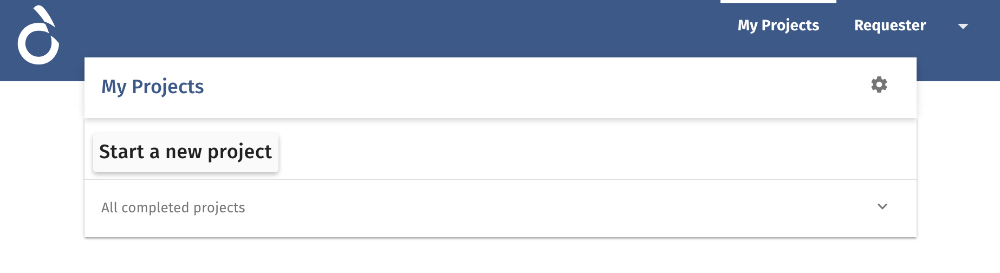
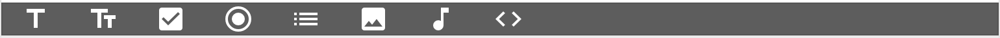
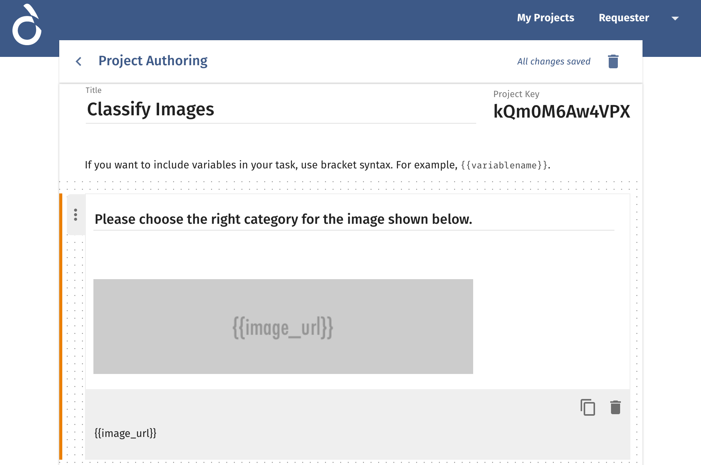
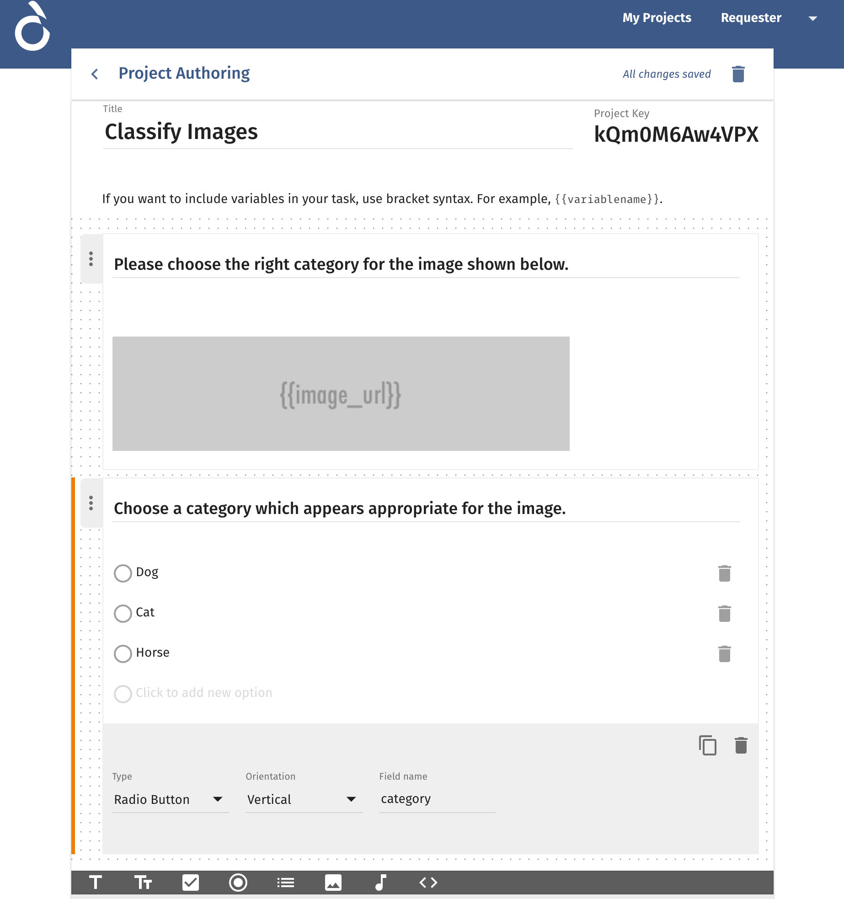
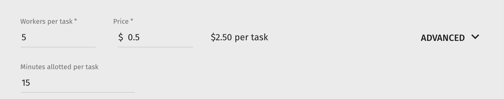
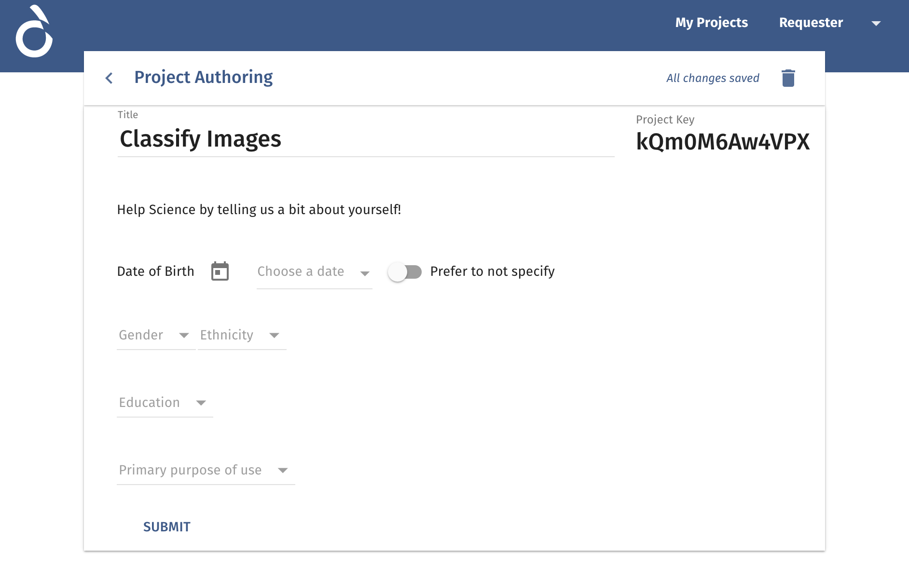
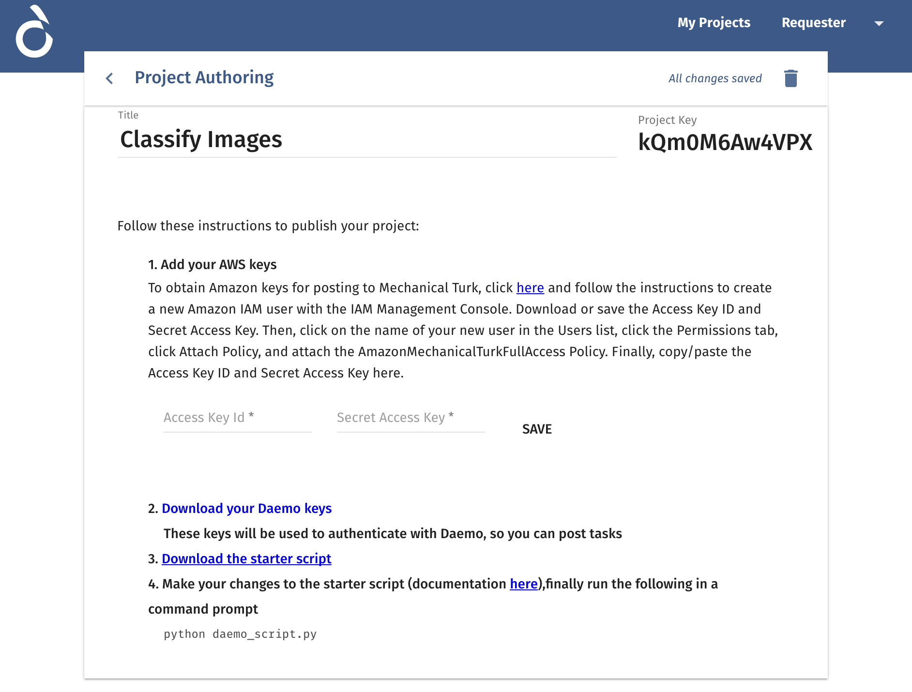

Step-by-step tutorial
#####################

The `samples directory </https://github.com/crowdresearch/daemo-api-client/tree/master/samples/>`_ in
the Daemo API Client contains many examples to get you started, but here's
a full tutorial to learn how to use Daemo Crowdsourcing Platform to create a project to classify images and write a script to monitor task submissions and rate workers.

Imagine we are building an AI based image processing system to identify few animals like cat, dog and horse for which we have a repository of images which need to be correctly labelled for supervised training of the learning model. We will use Daemo to create this dataset of image links and associated labels which can be fed to the system.

Daemo Platform
==============

Create a new project
--------------------
Once user is logged in, he/she can see all the projects created by him/her under My Projects

At the onset, there will be no projects as shown in above image.
To start creating a new project, Click on ``Start a new project`` button which opens up the Project Authoring Interface.

.. image:: images/blank-project.png

Now a new project will be created where title can be updated. We name it as ``Classify Images`` in this case
A project key ``kQm0M6Aw4VPX`` is generated which identifies the project and will be later used in API client to monitor this project.

Using different components
--------------------------
There is a radio component already added to the interface by default which we will use shortly.

At the bottom of the interface, a black bar shows different components which can be added to the project as shown below.

We can choose from Instructions, Text, Number, Check-box (Multi Selection), Radio-box (Single Selection), Select List (Single Selection), Image, Audio, Remote Component.

For the current task, we will add an image component to show an image to be classified and a radio-box component with a list of labels/categories to choose from. Image will be an input to the task and we would like to get it labelled or classified for a category as an output by workers.

To add an image component, Click on the ``hill`` sign which denotes image. An image component will get added to the interface. Drag the component from the handle on the left to the top of the interface so that it appears above the radio-box component.

Update the heading of the image component to ``Please choose the right category for the image shown below.``

Using variable parameters to define input values
------------------------------------------------

Now we need to configure it to show different images based on the image URL provided. We will use a variable parameter to define it. Update the Source URL to ``{{image_url}}``. Remember double curly braces denotes a variable which will be automatically replaced with data passed via API script using this variable name.

Using labels to capture output values
-------------------------------------

We already have a radio-box component for the category, so we will configure it instead.
Fill the heading as ``Choose a category which appears appropriate for the image.``
We will fill in the options as Cat, Dog and Horse to categorize the images. To actually identify the output, we will have to change the ``Field name`` of the component to ``category``.

Configure project options
-------------------------

Now the project design is complete. We will configure the project options for number of workers needed for each task and how much they will be paid for each task.
Fill the ``Minutes allotted per task`` to 15 which will set the time a worker is allowed to complete the task. Leave the other options as default for now.

Once we have filled the options, Click on ``Done``.

Requester information
---------------------

Now we will be presented with form to provide requester information. Please fill this based on your profile. This information is used only for scientific study purposes.

Project Launch and API Instructions
-----------------------------------

Once it is submitted, a new form appears with instructions. Please follow the instructions to fill in the AWS keys from Mechanical Turk. All the project tasks created will be posted to Mechanical Turk, so platform will need access to the keys to interact on your behalf with MTurk.

- From here, we can download the credentials ``credentials.json`` and the starter API script ``daemo.py`` to interact with the project we created.

Now the project is all set to be launched via API script.

Daemo API Client
================

Installation
------------

Daemo API Client is tested on Mac OS X and Linux with the latest Python 2.7.
To run a daemo client, you will need **python** and **virtualenv**.

On Debian-based systems::

    $ sudo apt-get install python-dev python-virtualenv

Create a virtualenv and install *daemo-api-client* in it ::

    $ virtualenv daemo
    $ pip install daemo-api-client

Create an API script to launch project
--------------------------------------
We already have a basic script ready in ``daemo.py`` where we need to update task input data and different callbacks which will be triggered at different stages.

Once we open the script in editor, we can see that input data has a specific structure

.. code-block:: python

    task_data = [
        {
            "image_url": "value"
        }
    ]

``value`` part needs to be replaced with the URL of the image. We can add as many records by duplicating one task and updating value to look like

.. code-block:: python

    task_data = [
        {
            "image_url": "value"
        }
        {
            "image_url": "value"
        }
    ]

With this, we have input data in place to launch tasks. But first we need to complete the callbacks.

Build a workflow to approve workers' submissions
------------------------------------------------
With the project launch, each task we mention in the input data will be submitted to the platform for N number of workers (Workers per task).
Once all tasks have a worker response, ``approve`` function in the script will be triggered. Therefore, we need to complete this function first.

This function as per `API Client Documentation <http://daemo-api-client.readthedocs.io/en/latest/source/daemo.client.html>`_  is used to approve worker submissions to release payment. We will write a basic procedure to assess if worker did the right job and approve his/her submission by passing a boolean value for each worker submission as a response.

Check the full script at `Image Classification </https://github.com/crowdresearch/daemo-api-client/tree/master/samples/image_classify.py>`_

Manage rating for the workers
-----------------------------
After workers' submissions are approved, ``completed`` callback will be triggered with only approved worker responses. We need to rate workers at this stage which gets fed up to the Daemo platform to improve the ongoing quality of responses as you launch more tasks.
For a simple rating function, check the full script at `Image Classification <https://github.com/crowdresearch/daemo-api-client/tree/master/samples/image_classify.py>`_

To learn more about API client, check the docs at `API Client Documentation <http://daemo-api-client.readthedocs.io/en/latest/source/daemo.client.html>`_

